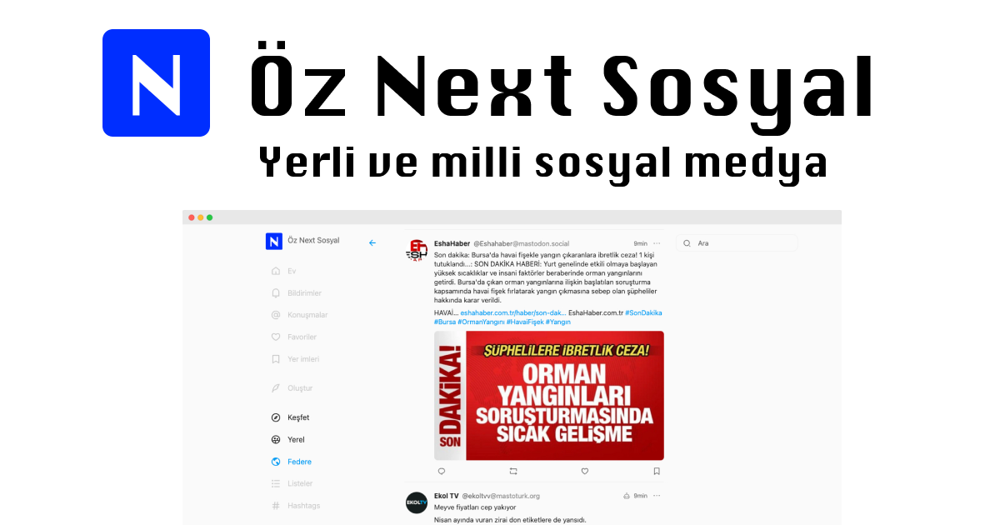

<p align="center">
  <a href="https://oznextsosyal.com" target="_blank" rel="noopener noreferrer">
    
  </a>
</p>

<h1 align="center"/>Öz Next Sosyal <sup><em>alpha</em></sup></h1>
<h2 align="center">Yerli ve milli sosyal medya</h2>

<p align="center">
  <a href="https://oznextsosyal.com" target="_blank" rel="noopener noreferrer">
    https://oznextsosyal.com
  </a>
</p>

<p align="center">
Türkçe Mastodon web istemcisi
</p>

<br/>

<p align="center">
  <a href="https://oznextsosyal.com" target="_blank" rel="noopener noreferrer" >
    
  </a>
</p>

## ⚠️ oznextsosyal is in Alpha

Bu Türkçe Mastodon web istemcisi, Elk projesinin özelleştirilmiş bir versiyonudur. Mastoturk.org sunucusu için optimize edilmiştir ve Türkçe dil desteği ile gelir. Proje hala geliştirme aşamasındadır ve geri bildirimlerinizi bekliyoruz.

> 5dkda elk forklayıp cursor ile revize edildi :lips:

## 🦄 Stack

- [Vite](https://vitejs.dev/) - Next Generation Frontend Tooling
- [Nuxt](https://nuxt.com/) - The Intuitive Web Framework
- [Vue](https://vuejs.org/) - The Progressive JavaScript Framework
- [VueUse](https://vueuse.org/) - Collection of Vue Composition Utilities
- [Pinia](https://pinia.vuejs.org/) - The Vue Store that you will enjoy using
- [Vue Macros](https://vue-macros.sxzz.moe/) - More macros and syntax sugar for Vue
- [UnoCSS](https://uno.antfu.me/) - The instant on-demand atomic CSS engine
- [Iconify](https://github.com/iconify/icon-sets#iconify-icon-sets-in-json-format) - Iconify icon sets in JSON format
- [Masto.js](https://neet.github.io/masto.js) - Mastodon API client in TypeScript
- [shiki](https://shiki.style/) - A beautiful yet powerful syntax highlighter
- [vite-plugin-pwa](https://github.com/vite-pwa/vite-plugin-pwa) - Prompt for update, Web Push Notifications and Web Share Target API

# Requirements

- [Node.js](https://nodejs.org/) - 22.x
- [pnpm](https://pnpm.io/) - 9.x
- [Mastodon](https://mastodon.social/) - 4.x
- [Elk](https://elk.zone/) - 1.x

# Installation

```bash
pnpm install
```

# Running Development Server

```bash
pnpm run dev
```

# Building

```bash
pnpm run build
```

# Running Production Server

```bash
pnpm run start
```

** Fork from elk-zone/elk ** and uses mastoturk.org as default server.

## 📄 License

[MIT](./LICENSE) &copy; 2025 selimdoyranli
